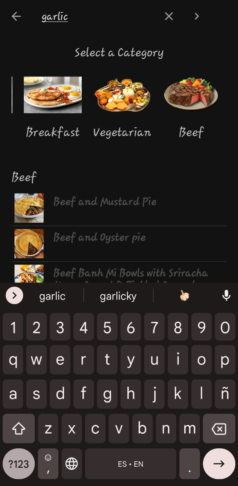
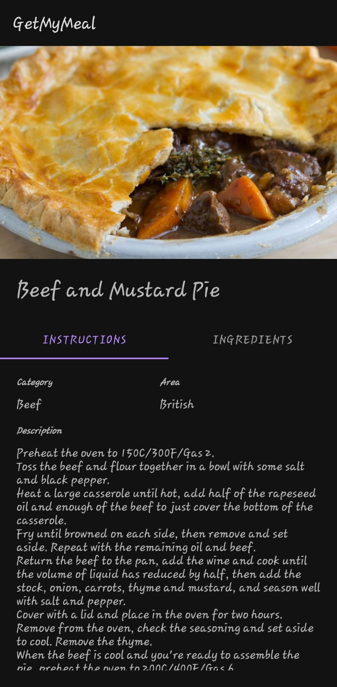
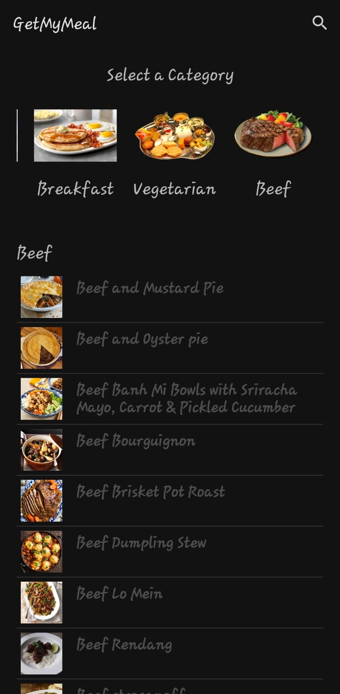

# GetMyMeal
## Introduction
GetMyMeal is an application designed for Android. It allows to choose a Meal and view it's description.

Search by criteria            |  Recipe Instructions          |  Ingredients          |  Sort by Category
:-------------------------:|:-------------------------:|:-------------------------:|:-------------------------:
  |   |   |  

Video           
:-------------------------:
[View](docs/appvideo.mp4)  

The application supports Android 4.1 Jelly Bean (API level 16) and above.

Features include:
* An easy-to-use interface.
* Sort by Meal Category in Main Screen
* Full Recipe Details and instructions
* Searchable by criteria (Name, Category, Ingredient)
* Preview of the Meal

# Installation

There are different ways to get the GetMyMeal app for Android; from github or building it yourself.

## Building

### With Gradle

This project requires the [Android SDK](http://developer.android.com/sdk/index.html)
to be installed in your development environment. In addition you'll need to set
the `ANDROID_HOME` environment variable to the location of your SDK. For example:

    export ANDROID_HOME=/home/<user>/tools/android-sdk

After satisfying those requirements, the build is pretty simple:

* Run `./gradlew build installDevelopmentDebug` from the within the project folder.
It will build the project for you and install it to the connected Android device or running emulator.

The app is configured to allow you to install a development and production version in parallel on your device.

### With Android Studio
The easiest way to build is to install [Android Studio](https://developer.android.com/sdk/index.html) v2.+
with [Gradle](https://www.gradle.org/) v3.4.1
Once installed, then you can import the project into Android Studio:

1. Open `File`
2. Import Project
3. Select `build.gradle` under the project directory
4. Click `OK`

Then, Gradle will do everything for you.
